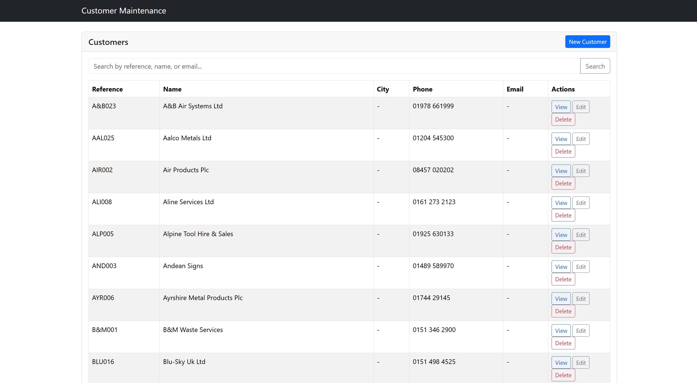
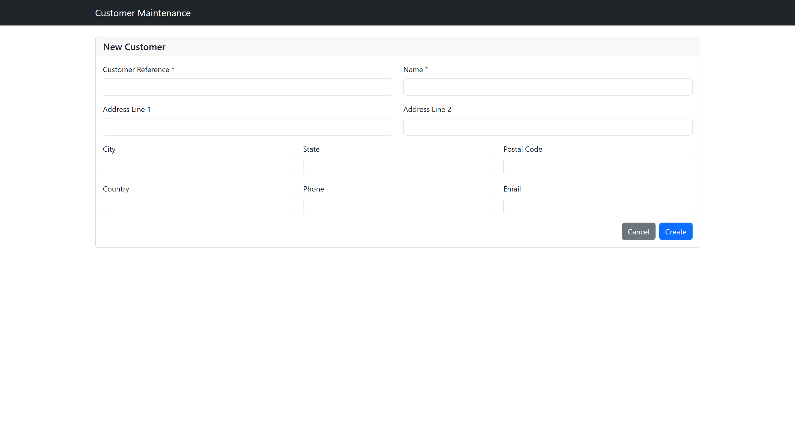
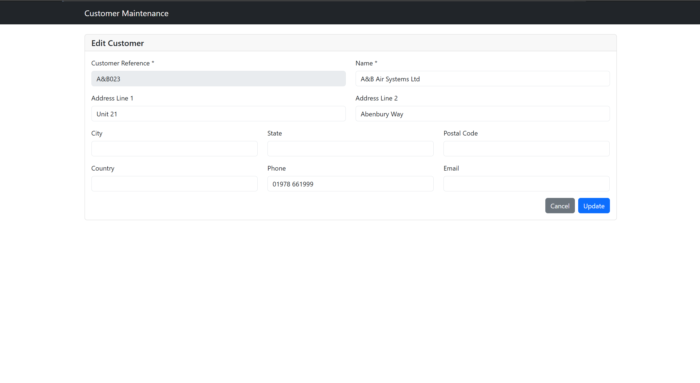

# Customer Maintenance

A full-stack web application for managing customer master data stored on IBM i (AS/400). Built with React, TypeScript, Express, and IBM's Mapepire JS for IBM i database connectivity.

## Features

- **Individual IBM i login** — each user signs in with their own OS/400 user profile and password
- **Per-user connection pool** — every authenticated session gets its own dedicated Mapepire connection pool that runs under that user's IBM i credentials; there is no shared service account
- Redis-backed sessions with configurable idle timeout
- Paginated customer list (20 records per page)
- Search by customer reference, name, or contact
- Create, view, edit, and delete customer records
- Responsive Bootstrap 5 UI
- Full TypeScript on both client and server

---

## Screenshots

**Login Screen** — users authenticate with their IBM i (OS/400) credentials.

**Customer List** — paginated table with search and actions for each record.



**New Customer** — form for creating a new customer record.



**Edit Customer** — form pre-populated with the selected customer's data.



---

## Table of Contents

1. [Prerequisites](#prerequisites)
2. [Redis Setup](#redis-setup)
3. [IBM i Database Setup](#ibm-i-database-setup)
4. [Mapepire Server Setup on IBM i](#mapepire-server-setup-on-ibm-i)
5. [Installation](#installation)
6. [Configuration](#configuration)
7. [Running the Application](#running-the-application)
8. [Authentication and Session Management](#authentication-and-session-management)
9. [Building for Production](#building-for-production)
10. [API Reference](#api-reference)
11. [Project Structure](#project-structure)
12. [Troubleshooting](#troubleshooting)

---

## Prerequisites

- **Node.js** 18 or later
- **npm** 9 or later
- **Redis** 6 or later (see [Redis Setup](#redis-setup))
- **IBM i** system with:
  - Mapepire server installed and running (see [Mapepire Server Setup](#mapepire-server-setup-on-ibm-i))
  - User profiles with `*USE` authority to the target library and `*CHANGE` authority to `CUSTMAST`
  - The `CUSTMAST` table created in your target library (see [IBM i Database Setup](#ibm-i-database-setup))

---

## Redis Setup

Sessions are stored in Redis. A running Redis instance is required before starting the server.

### Option A — Docker (recommended for development)

```bash
docker run -d --name redis -p 6379:6379 redis:alpine
```

To start it again after a reboot:

```bash
docker start redis
```

### Option B — WSL2 (Windows Subsystem for Linux)

```bash
sudo apt update && sudo apt install redis-server
sudo service redis start
```

To have Redis start automatically, add `sudo service redis start` to your WSL2 startup script.

### Option C — Memurai (Windows-native Redis)

Download and install the free Developer Edition from [memurai.com](https://www.memurai.com). It installs as a Windows service and starts automatically on boot.

### Verify Redis is running

```bash
redis-cli ping
# Expected response: PONG
```

If you need a password or a non-default port, set `REDIS_PASSWORD` and `REDIS_PORT` in your `.env` file accordingly.

---

## IBM i Database Setup

The application reads from and writes to a table named `CUSTMAST` in the library specified by `IBMI_LIBRARY` in your `.env` file.

### Create the CUSTMAST Table

Run the following SQL on your IBM i using ACS Run SQL Scripts, green-screen interactive SQL (`STRSQL`), or any SQL client:

```sql
CREATE TABLE MYLIB.CUSTMAST (
    CUSTREF   CHAR(10)      NOT NULL,
    NAME      CHAR(50)      NOT NULL,
    SHORTNAME CHAR(20)          NULL,
    ADDRESS1  CHAR(50)          NULL,
    ADDRESS2  CHAR(50)          NULL,
    ADDRESS3  CHAR(50)          NULL,
    ADDRESS4  CHAR(50)          NULL,
    POSTCODE  CHAR(15)          NULL,
    CREDLMT   DECIMAL(13, 2)    NULL,
    PHONE     CHAR(20)          NULL,
    WEBSITE   CHAR(100)         NULL,
    CONTACT   CHAR(50)          NULL,
    CONSTRAINT CUSTMAST_PK PRIMARY KEY (CUSTREF)
);
```

> Replace `MYLIB` with the library name you intend to use. That same name goes into `IBMI_LIBRARY` in your `.env` file.

### Optional: Load Sample Data

```sql
INSERT INTO MYLIB.CUSTMAST VALUES
    ('ACME001', 'Acme Corporation', 'Acme', '123 Main St', '', 'Springfield', 'IL', '62701', 50000.00, '555-100-0001', 'www.acme.com', 'Wile E. Coyote'),
    ('GLOBEX01', 'Globex Corporation', 'Globex', '1 Globex Way', '', 'Shelbyville', 'IL', '62565', 75000.00, '555-100-0002', 'www.globex.com', 'Hank Scorpio');
```

### Required IBM i Authorities

Because every user connects under their own OS/400 profile, each user needs the following object authorities:

| Object | Type | Authority |
|--------|------|-----------|
| `IBMI_LIBRARY` (library) | `*LIB` | `*USE` |
| `CUSTMAST` | `*FILE` | `*CHANGE` |
| `QSYS2` (system schema) | `*LIB` | `*USE` |

> There is no shared service account — IBM i authority is enforced at the individual user level, so standard OS/400 object authority and auditing apply naturally.

---

## Mapepire Server Setup on IBM i

This application connects to IBM i through **Mapepire**, an open-source REST/WebSocket server that runs on the IBM i and exposes a SQL execution interface.

### What is Mapepire?

Mapepire eliminates the need for ODBC drivers on the client machine. Instead, a lightweight server process runs on the IBM i and accepts connections over a standard port (default **8076**). The Node.js client (`@ibm/mapepire-js`) communicates with it over WebSocket.

### Installing Mapepire via ACS Open Source Manager

1. **Open ACS** and connect to your IBM i system.
2. Go to **Tools → Open Source Package Management**.
3. Select your IBM i system and click **Refresh** to load available packages.
4. Search for **mapepire-server** and check the box next to it.
5. Click **Install**. ACS will install the package and its dependencies.
6. After installation, click **Refresh** to confirm the package shows a version in the **Installed** column.

> If Open Source Package Management is not visible, update ACS to the latest release from the IBM support site.

### Starting the Mapepire Server

Open an SSH terminal to your IBM i (via ACS **Tools → Open Terminal**) and run:

```sh
/QOpenSys/pkgs/bin/mapepire-server
```

The server starts and listens on port **8076** by default. To use a different port:

```sh
/QOpenSys/pkgs/bin/mapepire-server --port 9000
```

Update `IBMI_PORT` in your `.env` if you change the port.

To run in the background so it survives terminal disconnect:

```sh
nohup /QOpenSys/pkgs/bin/mapepire-server &
```

### Verify Connectivity

From a PowerShell window on your development machine:

```powershell
Test-NetConnection -ComputerName your-ibmi-host -Port 8076
```

`TcpTestSucceeded : True` confirms the server is reachable.

### TLS / Certificate Notes

The client is configured with `rejectUnauthorized: false` (in [server/src/config/database.ts](server/src/config/database.ts)), which accepts self-signed certificates. This is suitable for development. For production, obtain a valid certificate and set `rejectUnauthorized: true`.

---

## Installation

```bash
# Clone the repository
git clone <repository-url>
cd customer-maintenance

# Install all dependencies (client and server) in one step
npm install
```

npm workspaces installs dependencies for both `client/` and `server/` from the root.

---

## Configuration

Copy the example environment file and fill in your values:

```bash
cp .env.example .env
```

Open `.env` and edit the values:

```env
# Server port
PORT=3001

# IBM i connection (Mapepire) — no shared credentials; users supply their own at login
IBMI_HOST=your-ibmi-hostname-or-ip
IBMI_PORT=8076
IBMI_LIBRARY=MYLIB

# Redis session store
REDIS_HOST=localhost
REDIS_PORT=6379
# REDIS_PASSWORD=your-redis-password

# Session security
SESSION_SECRET=replace-with-a-long-random-string
SESSION_TIMEOUT_MINUTES=30

# CORS — set to your frontend URL in production
CLIENT_URL=http://localhost:5173
```

### Generating a SESSION_SECRET

```bash
node -e "console.log(require('crypto').randomBytes(32).toString('hex'))"
```

Paste the output into `SESSION_SECRET`. Keep this value secret and do not commit it.

### Environment Variable Reference

| Variable | Required | Default | Description |
|----------|----------|---------|-------------|
| `PORT` | No | `3001` | Port the Express API server listens on |
| `IBMI_HOST` | **Yes** | — | Hostname or IP address of the IBM i |
| `IBMI_PORT` | No | `8076` | Port the Mapepire server listens on |
| `IBMI_LIBRARY` | No | `MYLIB` | IBM i library (schema) containing `CUSTMAST` |
| `REDIS_HOST` | No | `localhost` | Redis hostname |
| `REDIS_PORT` | No | `6379` | Redis port |
| `REDIS_PASSWORD` | No | — | Redis password (if auth is enabled) |
| `SESSION_SECRET` | **Yes** | — | Secret used to sign session cookies — must be long and random |
| `SESSION_TIMEOUT_MINUTES` | No | `30` | Minutes of inactivity before a session expires |
| `CLIENT_URL` | No | `http://localhost:5173` | Allowed CORS origin (set to your frontend URL in production) |

> **Note:** `IBMI_USER` and `IBMI_PASSWORD` are intentionally absent. Each user's IBM i credentials are supplied at the login screen and are never stored in the environment or on disk.

> **Security:** Never commit `.env` to source control. The `.gitignore` already excludes it.

---

## Running the Application

### Start Redis first

Make sure Redis is running before starting the server (see [Redis Setup](#redis-setup)).

### Development Mode

Open two terminals:

**Terminal 1 — API server** (auto-reloads on file changes, port 3001):

```bash
npm run dev:server
```

**Terminal 2 — React client** (Vite dev server with HMR, port 5173):

```bash
npm run dev:client
```

Then open [http://localhost:5173](http://localhost:5173). You will be presented with the login screen. Enter your IBM i user profile and password to continue.

The Vite dev server proxies all `/api/*` requests to `http://localhost:3001` automatically.

---

## Authentication and Session Management

### Login

Each user authenticates with their own IBM i (OS/400) user profile and password. There is no separate application user database — the IBM i is the single source of truth for user identity.

**Login flow:**

1. User enters their IBM i username and password on the login screen.
2. The server attempts to open a real Mapepire connection using those credentials.
3. If the IBM i accepts them, authentication succeeds. If the credentials are wrong or the profile is locked, a 401 is returned.
4. A session is created in Redis and a signed `httpOnly` cookie is sent to the browser.

### Per-User Connection Pool

> **Each authenticated session owns its own dedicated Mapepire connection pool.** Customer queries execute under the logged-in user's IBM i profile — never under a shared service account.

| Property | Value |
|----------|-------|
| Connections per user | 1 starting, up to 3 maximum |
| Pool created | At login |
| Pool destroyed | At logout, or when the session times out |
| Queries run as | The logged-in user's OS/400 profile |

This design means:

- IBM i **object-level authority** is enforced per user automatically — if an OS/400 profile lacks `*CHANGE` authority to `CUSTMAST`, that user's write operations will fail at the database level.
- IBM i **auditing** (if enabled) correctly records which user performed each operation.
- No single compromised service account can be used to access data on behalf of all users.

### Session Timeout

Sessions expire after `SESSION_TIMEOUT_MINUTES` minutes of inactivity (default: 30). The timer resets on every API request.

When a session expires:

- The Redis session record is removed.
- The in-memory connection pool is cleaned up (a background task checks every 5 minutes).
- The next request from that browser receives a 401, and the UI returns to the login screen.

If the application server restarts, all in-memory connection pools are destroyed. Users with still-valid Redis sessions will be prompted to log in again on their next request.

### Logout

Clicking **Sign Out** in the navbar immediately destroys the user's connection pool and removes the Redis session.

### Session Cookie

The session cookie is:

- `httpOnly` — not accessible to client-side JavaScript
- `sameSite: lax` — protects against CSRF for standard navigation
- `secure: true` in production (requires HTTPS)

---

## Building for Production

```bash
npm run build
```

This produces:
- `server/dist/` — compiled Express server
- `client/dist/` — bundled React SPA (static HTML/CSS/JS)

### Running the Production Build

Serve the static client files from a web server (Nginx, Apache, or Express static middleware) and start the API server:

```bash
npm start
```

In production, set `NODE_ENV=production` and ensure `SESSION_SECRET` is a strong, unique random value. The `secure` flag on the session cookie will be enabled automatically.

---

## API Reference

### Auth Endpoints

| Method | Path | Body / Params | Description |
|--------|------|---------------|-------------|
| `POST` | `/api/v1/auth/login` | `{ username, password }` | Authenticate and create session |
| `POST` | `/api/v1/auth/logout` | — | Destroy session and connection pool |
| `GET` | `/api/v1/auth/me` | — | Returns `{ username }` if authenticated, 401 otherwise |

### Customer Endpoints

All customer endpoints require a valid session cookie. Unauthenticated requests receive a `401` response.

| Method | Path | Description |
|--------|------|-------------|
| `GET` | `/api/v1/customers` | List all customers (paginated, `?page=1&limit=20`) |
| `GET` | `/api/v1/customers/search?q=acme` | Search by ref, name, or contact |
| `GET` | `/api/v1/customers/:custref` | Get a single customer |
| `POST` | `/api/v1/customers` | Create a new customer |
| `PUT` | `/api/v1/customers/:custref` | Update an existing customer |
| `DELETE` | `/api/v1/customers/:custref` | Delete a customer |

### Example Request Body (POST / PUT)

```json
{
  "custref": "ACME001",
  "name": "Acme Corporation",
  "shortname": "Acme",
  "address1": "123 Main St",
  "address2": "",
  "address3": "Springfield",
  "address4": "IL",
  "postcode": "62701",
  "credlmt": 50000.00,
  "phone": "555-100-0001",
  "website": "www.acme.com",
  "contact": "Wile E. Coyote"
}
```

---

## Project Structure

```
customer-maintenance/
├── .env.example               # Template for environment variables
├── package.json               # Root workspace — shared scripts
│
├── server/                    # Express API (Node.js / TypeScript)
│   └── src/
│       ├── config/
│       │   ├── database.ts          # createUserPool() — per-user Mapepire pool factory
│       │   └── redis.ts             # Redis client
│       ├── controllers/
│       │   ├── authController.ts    # login / logout / me
│       │   └── customerController.ts
│       ├── middleware/
│       │   ├── requireAuth.ts       # Session + pool guard for all customer routes
│       │   └── errorHandler.ts
│       ├── models/
│       │   └── customer.ts          # Types and Zod validation schemas
│       ├── routes/
│       │   ├── authRoutes.ts        # POST /login|logout, GET /me
│       │   └── customerRoutes.ts
│       ├── services/
│       │   ├── sessionPoolManager.ts  # In-memory Map<sessionId, Pool> lifecycle
│       │   └── customerService.ts     # SQL queries against CUSTMAST
│       ├── types/
│       │   └── session.d.ts         # TypeScript express-session augmentation
│       └── index.ts                 # Server entry point
│
└── client/                    # React SPA (Vite / TypeScript)
    └── src/
        ├── api/
        │   ├── authApi.ts           # login / logout / getMe
        │   └── customerApi.ts       # Customer CRUD + 401 interceptor
        ├── components/
        │   ├── LoginForm.tsx        # IBM i credential login form
        │   ├── common/
        │   │   └── Layout.tsx       # Navbar with username + Sign Out button
        │   └── ...                  # Customer list, form, detail components
        └── App.tsx                  # Auth state — login screen vs main app
```

---

## Troubleshooting

### Cannot connect to Redis

- Confirm Redis is running: `redis-cli ping` should return `PONG`.
- Check `REDIS_HOST` and `REDIS_PORT` in `.env`.
- If Redis requires a password, set `REDIS_PASSWORD`.
- The server will log `Redis error: ...` to the console if the connection fails.

### Cannot connect to IBM i

- Confirm the IBM i hostname/IP is reachable: `ping your-ibmi-host`.
- Confirm port 8076 (or your `IBMI_PORT`) is open using `Test-NetConnection -ComputerName your-ibmi-host -Port 8076`.
- Verify the Mapepire server process is running on the IBM i.

### Login returns "Invalid credentials"

- Check that the IBM i user profile is not disabled or expired.
- Ensure the password is correct (OS/400 passwords can be case-sensitive depending on system value `QPWDLVL`).
- Confirm the Mapepire server is running and reachable.

### `Missing required environment variables` error on startup

The server requires `IBMI_HOST` and `SESSION_SECRET`. Make sure your `.env` file exists in the project root and both variables are set.

### Session expires unexpectedly

- Increase `SESSION_TIMEOUT_MINUTES` in `.env`.
- Ensure Redis is not evicting keys due to memory pressure (`maxmemory-policy` should not be `allkeys-lru` for a session store).

### `Table CUSTMAST not found` / SQL0204 error

- Confirm the table exists in the library specified by `IBMI_LIBRARY`.
- Confirm the logged-in IBM i user has `*USE` authority to the library and `*CHANGE` authority to the table.

### Client shows no data / network errors

- Make sure Redis, the server (`npm run dev:server`), and the client (`npm run dev:client`) are all running.
- Check the browser console and the server terminal for error messages.
- Confirm the server is responding at `http://localhost:3001/api/v1/auth/me`.

### Port already in use

Change the `PORT` value in your `.env` file to a free port, then restart the server.
